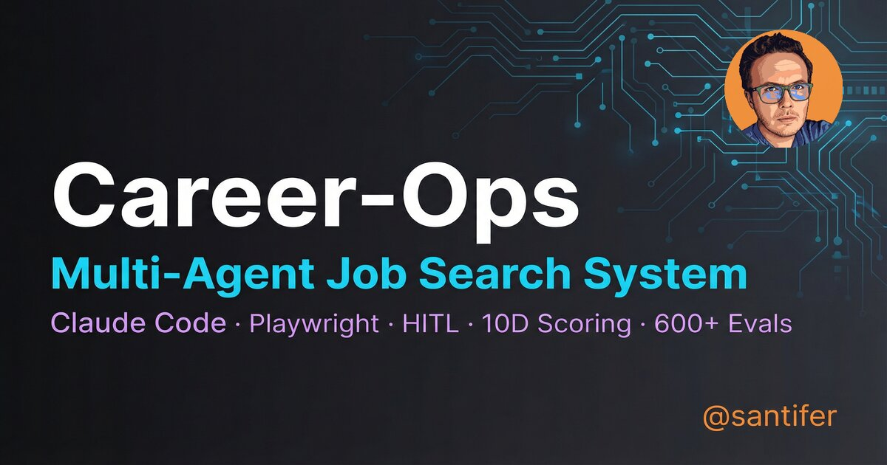

# Career-Ops

[English](README.md) | [Español](backend/README.es.md)

<p align="center">
  <a href="https://x.com/santifer"></a>
</p>

<p align="center">
  <em>I spent months applying to jobs the hard way. So I engineered the system I wish I had.</em><br>
  Companies use AI to filter candidates. <strong>I gave candidates AI to <em>choose</em> companies.</strong><br>
  <em>Now it's open source.</em>
</p>

<p align="center">
  
  
  
  
  
  
  
  <a href="https://discord.gg/8pRpHETxa4"></a>
</p>

---

<p align="center">
  
</p>

<p align="center"><strong>740+ job listings evaluated · 100+ personalized CVs · 1 dream role landed</strong></p>

## What Is This

Career-Ops turns any AI coding CLI into a full job search command center. Instead of manually tracking applications in a spreadsheet, you get an AI-powered pipeline that:

- **Evaluates offers** with a structured A-F scoring system (10 weighted dimensions)
- **Generates tailored PDFs** — ATS-optimized CVs customized per job description
- **Scans portals** automatically (Greenhouse, Ashby, Lever, company pages)
- **Processes in batch** — evaluate 10+ offers in parallel with sub-agents
- **Tracks everything** in a single source of truth with integrity checks
- **Web Dashboard** — manage your entire pipeline visually from the browser
- **Claude Chat** — talk to Claude CLI from a web UI with streaming responses

> **Important: This is NOT a spray-and-pray tool.** Career-ops is a filter — it helps you find the few offers worth your time out of hundreds.

---

## Quick Start

```bash
# 1. Clone
git clone https://github.com/santifer/career-ops.git
cd career-ops

# 2. Install everything & launch
./start.sh

# 3. Open the dashboard
open http://localhost:3000
```

The `start.sh` script handles Node.js detection, dependency installation for both frontend and backend, and launches the web dashboard.

---

## Repository Architecture

The project is split into two top-level directories with a clear separation of concerns:

```
career-ops/
├── start.sh                    # One-command launcher (installs deps + starts frontend)
├── .gitignore                  # Unified ignore rules for both sides
│
├── frontend/                   # 🖥️  Web Dashboard (Next.js)
│   ├── src/app/                #     App Router pages + API routes
│   ├── src/app/api/chat/       #     Chat endpoints (/api/chat, /api/chat/stop)
│   ├── src/app/api/ops/        #     Operations endpoints (/api/ops/*)
│   ├── src/components/         #     Reusable UI components
│   ├── src/lib/                #     Parsers, writers, utilities
│   ├── __tests__/              #     Vitest unit tests
│   └── docs/                   #     Frontend-specific documentation
│
└── backend/                    # ⚙️  Core Engine (Node.js + Go + AI modes)
    ├── modes/                  #     AI behavior instructions (14 modes)
    ├── data/                   #     Tracking data (applications, pipeline, scan-history)
    ├── reports/                #     Generated evaluation reports
    ├── config/                 #     User personalization (profile.yml)
    ├── templates/              #     HTML/YAML templates
    ├── batch/                  #     Batch processing orchestrator
    ├── dashboard/              #     Go TUI terminal viewer
    ├── *.mjs                   #     Utility scripts (doctor, active-gate, pdf, etc.)
    └── docs/                   #     Architecture, setup, customization guides
```

---

## Frontend — Web Dashboard

The frontend is a **Next.js 16 App Router** application with **TypeScript** and **Tailwind CSS v4**. It provides a visual interface to the backend's file-based data.

### Pages

| Route | Page | Description |
|-------|------|-------------|
| `/` | **Overview** | KPI cards (total applications, avg score, pipeline counts), recent applications table, status distribution chart |
| `/applications` | **Applications** | Full tracker table with search, sort, filter by status. Click rows to preview reports. Inline status editing |
| `/pipeline` | **Pipeline** | Pending vs processed view. Each pending item shows company, role, URL with an "Evaluate now" action |
| `/scan-history` | **Scan History** | TSV log viewer with status filter pills (added, skipped_title, skipped_dup, skipped_expired) |
| `/chat` | **Claude Chat** | Browser-based interface to Claude CLI with streaming responses, quick action buttons, and message history |

### API Routes (Server-Side)

The frontend reads/writes backend data files through Next.js API routes — the browser never touches the filesystem directly:

```
Browser  ──►  Next.js API Route  ──►  backend/data/*.md, backend/reports/*.md
              (server-side only)
```

| Endpoint | Method | Description |
|----------|--------|-------------|
| `/api/stats` | GET | Aggregated KPIs from applications.md |
| `/api/applications` | GET/PATCH | Read tracker table, update status/notes |
| `/api/pipeline` | GET | Pending + processed items from pipeline.md |
| `/api/scan-history` | GET | Parsed TSV entries with optional status filter |
| `/api/reports/[slug]` | GET | Markdown content of a single report |
| `/api/chat` | POST | Spawn `claude -p` as child process, stream output via SSE |
| `/api/chat/stop` | POST | Kill a running chat/ops process by session ID |
| `/api/ops/scan` | POST | Run portal scan and stream operation logs via SSE |
| `/api/ops/active-gate` | POST | Run active-gate liveness filter and stream logs via SSE |
| `/api/ops/pipeline` | POST | Process pending pipeline items and stream logs via SSE |

### Data Flow

```
backend/data/applications.md  ──►  lib/parsers/applications.ts  ──►  /api/applications  ──►  Applications page
backend/data/pipeline.md      ──►  lib/parsers/pipeline.ts      ──►  /api/pipeline      ──►  Pipeline page
backend/data/scan-history.tsv ──►  lib/parsers/scan-history.ts  ──►  /api/scan-history   ──►  Scan History page
backend/reports/*.md           ──►  lib/parsers/reports.ts       ──►  /api/reports/[slug] ──►  Report Viewer panel
```

Path resolution: `frontend/src/lib/data-path.ts` resolves all paths relative to the sibling `../backend/` directory.

### Component Library

| Component | Purpose |
|-----------|---------|
| `AppShell` | Client-side layout wrapper with sidebar toggle state |
| `Sidebar` | Navigation with active page highlight |
| `Header` | Top bar with search, mobile hamburger |
| `StatCard` | Gradient KPI card with icon and subtitle |
| `StatusBadge` | Color-coded pill (Evaluated, Applied, Interview, etc.) |
| `ReportViewer` | Slide-out panel with markdown rendering |
| `EditDialog` | Modal for updating application status/notes |
| `SearchInput` | Debounced search with clear button |
| `EmptyState` | Placeholder when no data is available |
| `LoadingSkeleton` | Animated pulse placeholders for loading states |

### Claude Chat Architecture

The chat page provides a browser-based interface to the locally installed Claude CLI:

```
Browser (React)                      Next.js Server Route                Claude CLI
     │                                      │                              │
  ├── POST /api/chat ───────────────────►│                              │
     │   { message: "scan" }                │                              │
     │                                      ├── spawn("claude", ["-p"]) ──►│
     │                                      │     cwd: backend/            │
     │   ◄── SSE: event:session ────────────┤                              │
     │   ◄── SSE: event:delta  ◄────────────┤◄── stdout ───────────────────┤
     │   ◄── SSE: event:delta  ◄────────────┤◄── stdout ───────────────────┤
     │   ◄── SSE: event:done   ◄────────────┤◄── exit 0 ──────────────────│
     │                                      │                              │
  ├── POST /api/chat/stop ──────────────►│── SIGTERM ──────────────────►│
```

Key constraints:
- Browser **never** runs shell commands directly
- Only `claude -p <message>` is spawned — no arbitrary shell execution
- 5-minute timeout with automatic process cleanup
- One process per session (new messages kill the previous one)

---

## Backend — Core Engine

The backend contains all business logic, AI agent instructions, data files, and utility scripts. It runs on **Node.js 18+** with **Playwright** for web automation and **Go** for the terminal dashboard.

### System Overview

```
                    ┌─────────────────────────────────┐
                    │         Claude Code Agent        │
                    │   (reads CLAUDE.md + modes/*.md) │
                    └──────────┬──────────────────────┘
                               │
            ┌──────────────────┼──────────────────────┐
            │                  │                       │
     ┌──────▼──────┐   ┌──────▼──────┐   ┌───────────▼────────┐
     │ Single Eval  │   │ Portal Scan │   │   Batch Process    │
     │ (auto-pipe)  │   │  (scan.md)  │   │   (batch-runner)   │
     └──────┬──────┘   └──────┬──────┘   └───────────┬────────┘
            │                  │                       │
            │           ┌──────▼──────┐          ┌────▼─────┐
            │           │ pipeline.md │          │ N workers│
            │           │ (URL inbox) │          │ (claude -p)
            │           └──────┬──────┘          └────┬─────┘
            │                  │                       │
            │           ┌──────▼──────┐                │
            │           │ active-gate │                │
            │           │ (HTTP gate) │                │
            │           └──────┬──────┘                │
            │                  │                       │
     ┌──────▼──────────────────▼───────────────────────▼──────┐
     │                    Output Pipeline                      │
     │  ┌──────────┐  ┌────────────┐  ┌───────────────────┐  │
     │  │ Report.md│  │  PDF (HTML  │  │ Tracker TSV       │  │
     │  │ (A-F eval)│  │  → Playwright)│ │ (merge-tracker)  │  │
     │  └──────────┘  └────────────┘  └───────────────────┘  │
     └────────────────────────────────────────────────────────┘
                               │
                    ┌──────────▼──────────┐
                    │  data/applications.md │
                    │  (canonical tracker)  │
                    └──────────────────────┘
```

### AI Modes (14 total)

Career-Ops uses a **mode-based architecture** where each mode is a markdown file that instructs Claude how to perform a specific task:

| Mode | File | Description |
|------|------|-------------|
| **Auto-Pipeline** | `CLAUDE.md` | Default: paste a URL → full evaluation + PDF + tracking |
| **Evaluation** | `modes/oferta.md` | 6-block A-F scoring across 10 dimensions |
| **Pipeline** | `modes/pipeline.md` | Process pending URLs in sequence |
| **Scan** | `modes/scan.md` | Discover new jobs from portals (3-level strategy) |
| **PDF** | `modes/pdf.md` | Generate ATS-optimized CVs |
| **Batch** | `modes/batch.md` | Parallel evaluation with `claude -p` workers |
| **Apply** | `modes/apply.md` | Fill application forms with AI |
| **Deep Research** | `modes/deep.md` | Deep company research before interviews |
| **Interview Prep** | `modes/interview-prep.md` | STAR story bank + behavioral prep |
| **Contact** | `modes/contacto.md` | LinkedIn outreach messages |
| **Training** | `modes/training.md` | Evaluate courses and certifications |
| **Project** | `modes/project.md` | Evaluate portfolio projects |
| **Patterns** | `modes/patterns.md` | Rejection pattern analysis |
| **Tracker** | `modes/tracker.md` | View and manage application statuses |

Available in 5 languages: EN, ES, DE, FR, PT-BR.

### Utility Scripts

| Script | npm command | Description |
|--------|-------------|-------------|
| `doctor.mjs` | `npm run doctor` | System health check — validates all files and directories |
| `active-gate.mjs` | `npm run active-gate` | HTTP-only liveness gate — removes expired URLs from pipeline before evaluation |
| `generate-pdf.mjs` | `npm run pdf` | Generate ATS-optimized PDF from CV + job description |
| `merge-tracker.mjs` | `npm run merge` | Merge batch TSV additions into applications.md |
| `verify-pipeline.mjs` | `npm run verify` | Pipeline health check (statuses, duplicates, links) |
| `dedup-tracker.mjs` | `npm run dedup` | Remove duplicate entries by company+role |
| `normalize-statuses.mjs` | `npm run normalize` | Map status aliases to canonical values |
| `check-liveness.mjs` | `npm run liveness` | Playwright-based URL liveness check |
| `cv-sync-check.mjs` | `npm run sync-check` | Validate CV/config consistency |
| `analyze-patterns.mjs` | - | Detect rejection patterns across evaluations |
| `update-system.mjs` | `npm run update` | Self-updater with rollback support |
| `test-all.mjs` | - | Run all system tests |
| `test-active-gate.mjs` | `npm run test:active-gate` | 19 unit tests for active-gate logic |

### Data Files

| File | Format | Description |
|------|--------|-------------|
| `data/applications.md` | Markdown table | Canonical tracker — every evaluated application |
| `data/pipeline.md` | Markdown checklist | Pending URLs (Pendientes) + processed (Procesadas) |
| `data/scan-history.tsv` | TSV | Every URL ever seen by the scanner with status |
| `reports/*.md` | Markdown | Full A-F evaluation reports per application |
| `config/profile.yml` | YAML | Your identity, target roles, narrative |
| `portals.yml` | YAML | Portal scan configuration (45+ companies) |
| `cv.md` | Markdown | Your CV — source of truth for all evaluations |

### Active-Gate (Token-Free Link Filter)

The active-gate checks all pending pipeline URLs via HTTP fetch before they reach Claude evaluation, saving API tokens:

```bash
# Preview what would change (no file modifications):
npm run active-gate -- --dry-run

# Apply: remove expired links, log to scan-history
npm run active-gate
```

Detection logic (zero LLM tokens):
- **HTTP 404/410** → `skipped_expired`
- **Body phrases** ("position has been filled", "no longer accepting") → `skipped_expired`
- **Redirect** to `?error=true` (Greenhouse pattern) → `skipped_expired`
- **"Apply Now"** button or ATS metadata → `active`
- **HTTP 403** or ambiguous → `skipped_unconfirmed`

### Dashboard TUI (Go)

A standalone terminal UI built with **Go + Bubble Tea + Lipgloss** (Catppuccin Mocha theme):

```bash
cd backend/dashboard
go build -o career-dashboard .
./career-dashboard --path ..
```

Features: 6 filter tabs, 4 sort modes, grouped/flat view, lazy-loaded report previews, inline status picker.

---

## Evaluation Flow

```
You paste a job URL or description
        │
        ▼
┌──────────────────┐
│  Archetype       │  Classifies: LLMOps / Agentic / PM / SA / FDE / Transformation
│  Detection       │
└────────┬─────────┘
         │
┌────────▼─────────┐
│  A-F Evaluation  │  Match, gaps, comp research, STAR stories
│  (reads cv.md)   │
└────────┬─────────┘
         │
    ┌────┼────┐
    ▼    ▼    ▼
 Report  PDF  Tracker
  .md   .pdf   .tsv
```

### Scoring System

Each evaluation produces a weighted score across 10 dimensions (1-5 scale):

| Dimension | What It Measures |
|-----------|-----------------|
| Role Fit | How well the role matches your experience |
| Technical Match | Skill overlap between CV and JD |
| Growth Potential | Learning and career advancement opportunity |
| Company Stage | Startup vs enterprise alignment |
| Compensation | Market rate competitiveness |
| Location/Remote | Geographic and flexibility match |
| Culture Signals | Values alignment from JD language |
| Impact Scope | Potential for meaningful contribution |
| Interview Readiness | How prepared you'd be based on your experience |
| Strategic Value | Long-term career positioning benefit |

---

## Tech Stack

| Layer | Technology |
|-------|-----------|
| **Frontend** | Next.js 16 (App Router), React 19, TypeScript, Tailwind CSS v4 |
| **Backend Agent** | Claude Code with custom modes and skills |
| **Utility Scripts** | Node.js 18+, Playwright (PDF + web scraping) |
| **Terminal Dashboard** | Go 1.21+, Bubble Tea, Lipgloss (Catppuccin Mocha) |
| **Data Storage** | File-based — Markdown tables, YAML configs, TSV logs |
| **Testing** | Vitest (frontend), custom test runner (backend) |

---

## Pre-configured Portals

The scanner comes with **45+ companies** and **19 search queries** across major job boards:

**AI Labs:** Anthropic, OpenAI, Mistral, Cohere, LangChain, Pinecone
**Voice AI:** ElevenLabs, PolyAI, Parloa, Hume AI, Deepgram, Vapi, Bland AI
**AI Platforms:** Retool, Airtable, Vercel, Temporal, Glean, Arize AI
**Contact Center:** Ada, LivePerson, Sierra, Decagon, Talkdesk, Genesys
**Enterprise:** Salesforce, Twilio, Gong, Dialpad
**LLMOps:** Langfuse, Weights & Biases, Lindy, Cognigy, Speechmatics
**Automation:** n8n, Zapier, Make.com
**European:** Factorial, Attio, Tinybird, Clarity AI, Travelperk

**Job boards searched:** Ashby, Greenhouse, Lever, Wellfound, Workable, RemoteFront

---

## Configuration

```bash
# 1. Configure your profile
cp backend/config/profile.example.yml backend/config/profile.yml
# Edit with your details: name, email, target roles, narrative

# 2. Add your CV
# Create backend/cv.md with your full CV in markdown format

# 3. Configure portals
cp backend/templates/portals.example.yml backend/portals.yml
# Customize companies and search queries

# 4. Verify setup
cd backend && npm run doctor
```

> **The system is designed to be customized by Claude itself.** Modes, archetypes, scoring weights — just ask Claude to change them. It reads the same files it uses, so it knows exactly what to edit.

---

## Disclaimer

**career-ops is a local, open-source tool — NOT a hosted service.** By using this software, you acknowledge:

1. **You control your data.** Your CV, contact info, and personal data stay on your machine.
2. **You control the AI.** The default prompts instruct the AI not to auto-submit applications.
3. **You comply with third-party ToS.** Use this tool in accordance with career portal Terms of Service.
4. **No guarantees.** Evaluations are recommendations, not truth. AI models may hallucinate.

See [LEGAL_DISCLAIMER.md](backend/LEGAL_DISCLAIMER.md) for full details.

## License

MIT

## Let's Connect

[](https://santifer.io)
[](https://linkedin.com/in/santifer)
[](https://x.com/santifer)
[](https://discord.gg/8pRpHETxa4)
[](https://buymeacoffee.com/santifer)
